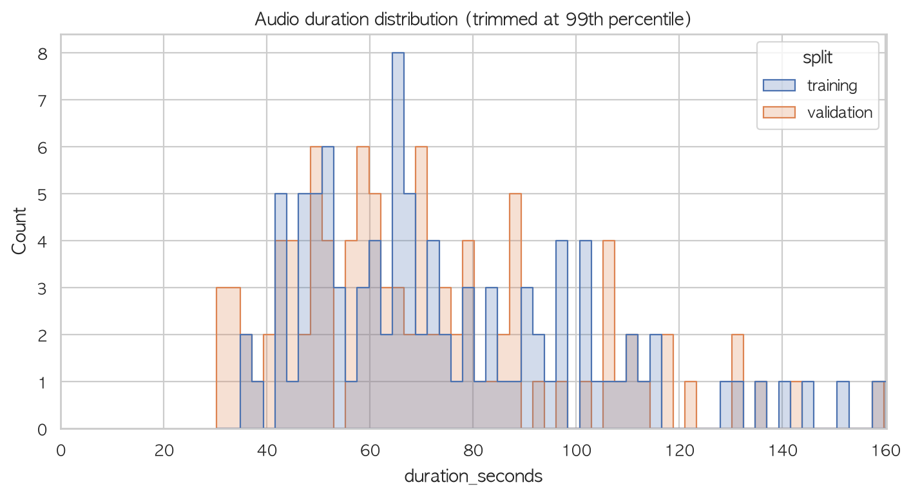
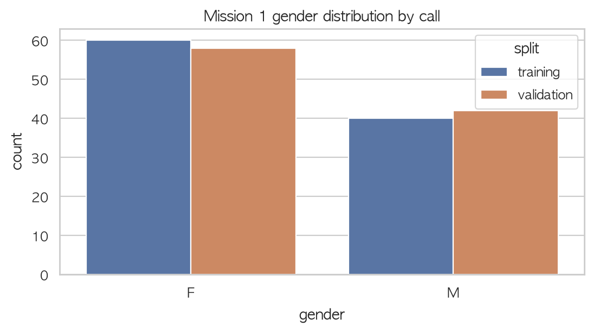
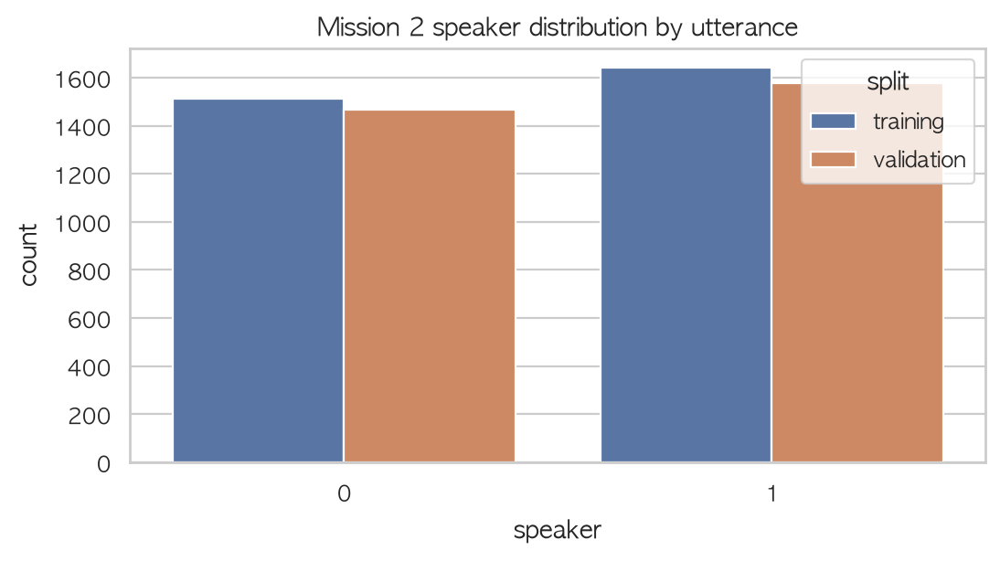
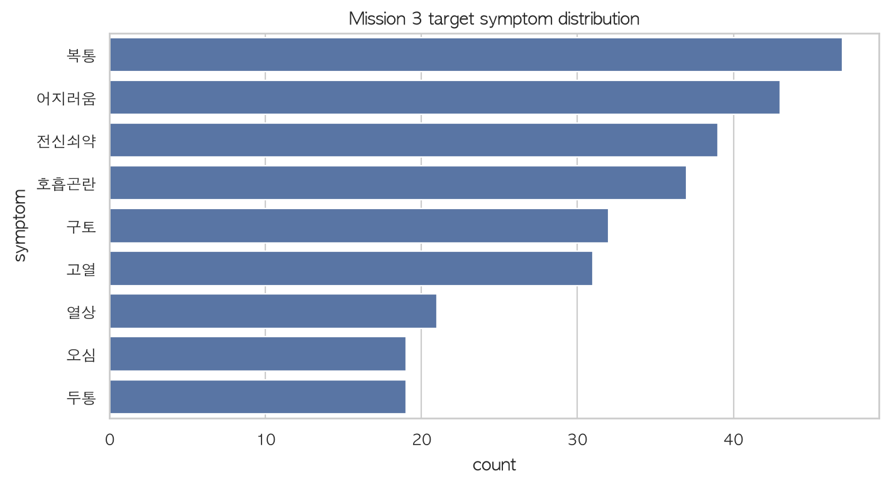

# 샘플 데이터 EDA 및 Whisper 입력 설계

> 이 문서는 오디오와 JSON 파일명이 일치하는 데이터에서 Training 100건, Validation 100건을 고정 시드(`42`)로 추출한 1차 분석입니다. Validation은 비교 분석에만 사용하며 학습에는 사용하지 않습니다.

## 1. 한눈에 보는 결론

- 원본 WAV는 모두 **8kHz, mono, 16-bit PCM**입니다. Whisper 입력 전에 반드시 mono float waveform으로 읽고 **16kHz로 리샘플링**해야 합니다.
- 통화 한 건은 중앙값 약 **67초**로 Whisper의 30초 입력보다 깁니다. 통화 전체를 한 번에 넣지 말고 미션 목적에 맞게 구간화해야 합니다.
- 발화 조각은 중앙값 약 **1.5초**이고 약 30%가 1초 이하입니다. Mission 2에서 매 조각을 30초로 패딩하면 계산량과 무음 비율이 지나치게 커집니다.
- Mission 1은 허용된 `speaker` 정보를 이용해 신고자(`speaker=1`) 발화만 모아 Whisper Encoder 임베딩을 집계하는 방식이 적합합니다.
- Mission 2는 짧은 발화 분류이므로 먼저 Log-Mel + 작은 CNN을 baseline으로 만들고, Whisper Encoder는 성능 비교 실험으로 두는 편이 효율적입니다.
- Mission 3은 규정상 전사 텍스트만 입력할 수 있으므로 Whisper 오디오 Encoder를 사용하지 않고 한국어 텍스트 다중라벨 분류기로 처리해야 합니다.

## 2. 데이터 구성과 품질

| 구분 | Training | Validation |
|---|---:|---:|
| 분석한 통화 | 100 | 100 |
| 총 음성 시간 | 2.15시간 | 1.99시간 |
| WAV만 있고 JSON 없음 | 1,758 | 963 |
| JSON만 있고 WAV 없음 | 1,061 | 29 |

전체 파일명 stem 기준 미매칭 항목은 **3,811개**입니다. 현재 EDA는 정상 매칭 데이터만 사용했으므로 실행에는 문제가 없지만, 본 학습 전에 압축 해제 또는 다운로드 누락 여부를 확인해야 합니다.



### 통화 길이

| 구분 | 평균 | 중앙값 | 90% 지점 | 최댓값 |
|---|---:|---:|---:|---:|
| Training | 77.3초 | 68.5초 | 116.2초 | 165.0초 |
| Validation | 71.6초 | 65.6초 | 110.8초 | 166.6초 |

## 3. Mission 1 - 신고자 성별

| 구분 | 여성(F) | 남성(M) |
|---|---:|---:|
| Training | 60 | 40 |
| Validation | 58 | 42 |



Training 샘플은 여성 60%, 남성 40%로 약한 불균형이 있습니다. Accuracy만 보지 말고 성별 confusion matrix와 클래스별 recall도 같이 확인하는 것이 좋습니다.

### Whisper에 넣는 권장 방식

1. 원본 8kHz WAV를 16kHz mono waveform으로 리샘플링합니다.
2. JSON의 `startAt`, `endAt`, `speaker`만 이용해 `speaker=1` 신고자 구간을 자릅니다.
3. 너무 짧은 발화를 각각 30초 패딩하지 말고, 같은 통화의 신고자 발화를 시간순으로 모아 최대 30초 단위 chunk로 구성합니다.
4. `whisper.log_mel_spectrogram(..., n_mels=model.dims.n_mels)`로 모델과 동일한 Mel 채널 수를 만듭니다.
5. `model.embed_audio()` 출력에 masked mean/attention pooling을 적용하고, 여러 chunk가 있으면 다시 평균 또는 attention 집계하여 성별을 분류합니다.

## 4. Mission 2 - 신고자/119대원 분류

| 구분 | 119대원(0) | 신고자(1) |
|---|---:|---:|
| Training | 1,514 | 1,641 |
| Validation | 1,469 | 1,576 |



전체 발화 중앙값은 **1.49초**, 1초 이하 비율은 **31.2%**, 최댓값은 **15.13초**입니다. 30초가 넘는 발화는 샘플에 없었습니다.

### 권장 실험 순서

1. **Baseline:** 발화 조각 → 16kHz → Whisper 방식 Log-Mel → 작은 CNN/ResNet → speaker 분류.
2. **Whisper 비교군:** 같은 Log-Mel을 30초로 패딩해 frozen Whisper AudioEncoder에 넣고, 실제 발화 프레임만 masked pooling → 작은 분류기.
3. 개선 효과가 있을 때만 Whisper 일부 또는 전체를 fine-tuning합니다.

Whisper 공식 Encoder에 그대로 넣으려면 30초 고정 입력이 필요합니다. 중앙값 1.5초인 현재 데이터에는 대부분이 padding이 되므로, 첫 모델부터 Whisper 전체를 fine-tuning하는 것은 속도와 메모리 면에서 비효율적입니다. 또한 규정상 `text`와 발화 순서는 Mission 2 입력에 사용하면 안 됩니다.

## 5. Mission 3 - 환자 증상 인식

| 증상 | Training | Validation |
|---|---:|---:|
| 고열 | 15 | 16 |
| 구토 | 15 | 17 |
| 두통 | 11 | 8 |
| 복통 | 24 | 23 |
| 어지러움 | 20 | 23 |
| 열상 | 10 | 11 |
| 오심 | 9 | 10 |
| 전신쇠약 | 18 | 21 |
| 호흡곤란 | 20 | 17 |



대상 9개 증상이 하나도 남지 않은 통화는 Training 0건, Validation 0건입니다. 클래스별 빈도 차이가 있으므로 `BCEWithLogitsLoss`와 클래스별 `pos_weight`, validation 기반 클래스별 threshold 조정을 고려할 수 있습니다.

Mission 3 입력은 전사 텍스트뿐이므로 Whisper Mel/AudioEncoder를 사용하면 안 됩니다. 전사 텍스트 → 한국어 tokenizer → KoBERT/KoELECTRA 계열 Encoder → 9개 sigmoid 출력의 다중라벨 분류가 자연스럽습니다.

## 6. Mel spectrogram 관찰

`mel_examples.png`는 로컬에서 생성되지만 원본 음성의 직접 변환물이므로 Git에는 포함하지 않습니다.

밝은 세로 패턴은 발화 에너지가 큰 구간이고 어두운 부분은 무음에 가깝습니다. 샘플마다 무음 구간의 위치와 길이가 크게 다르므로, 통화 전체 이미지를 단순 resize하면 시간축 정보가 왜곡될 수 있습니다. 반드시 발화 구간 또는 일정 길이 chunk를 기준으로 처리합니다.

## 7. 권장 입력 파이프라인

```text
Mission 1
8kHz 통화 → speaker=1 구간 추출 → 16kHz → 최대 30초 chunk
→ Whisper Log-Mel → Whisper AudioEncoder → chunk/call pooling → gender

Mission 2
8kHz 통화 → startAt/endAt 발화 추출 → 16kHz → Log-Mel
→ 우선 작은 CNN baseline → 필요 시 Whisper AudioEncoder 비교 → speaker

Mission 3
JSON 전사 text → 한국어 tokenizer/Encoder → 9개 sigmoid → symptom list
```

## 8. 다음 확인 사항

- 전체 학습 전 WAV/JSON 미매칭 3,811개의 원인을 확인합니다.
- 100건 샘플 결과이므로 최종 클래스 분포는 전체 매칭 데이터로 다시 계산합니다.
- Mission 1은 신고자 발화 누적 길이와 통화별 발화 수를 추가 분석합니다.
- Mission 2는 짧은 발화에서 padding 길이(4초, 8초, 30초)가 성능에 미치는 영향을 비교합니다.
- 모델 비교는 동일 split과 seed에서 Log-Mel CNN vs frozen Whisper Encoder로 수행합니다.

## 참고

- [OpenAI Whisper audio preprocessing](https://github.com/openai/whisper/blob/main/whisper/audio.py)
- [OpenAI Whisper AudioEncoder](https://github.com/openai/whisper/blob/main/whisper/model.py)
- [OpenAI Whisper usage example](https://github.com/openai/whisper/blob/main/README.md)
